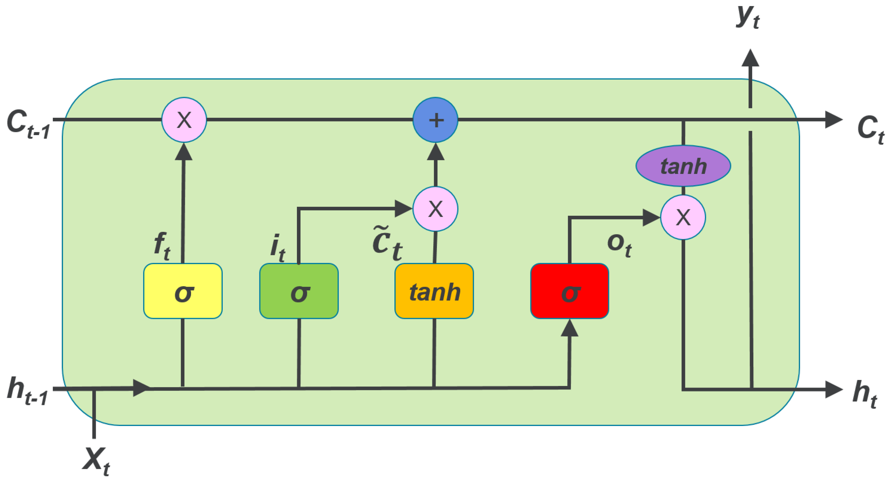

# KerasLSTM


Using Keras LSTM in Java. THe ipython notebook exports the weights of an LSTM
and also exports some test for a random input sequence and the resulting output.
The Java implementation reads the exported weights and then applies them. All
matrix operations are implemented using jBlas.

+ The numeric helper class implements matrix loading and slicing.
+ Tanh and the sigmoid functions are also in the helper class.
+ The LSTM state is a seperate class holding the cell state and the hidden activation.
+ The LSTM holds all the weights and applies them to sequences.

The basic slicing of the weights is implemented using the same weight
coding as Keras [Link](https://github.com/keras-team/keras/blob/2.1.4/keras/layers/recurrent.py#L1776)

```
        self.kernel_i = self.kernel[:, :self.units]
        self.kernel_f = self.kernel[:, self.units: self.units * 2]
        self.kernel_c = self.kernel[:, self.units * 2: self.units * 3]
        self.kernel_o = self.kernel[:, self.units * 3:]

        self.recurrent_kernel_i = self.recurrent_kernel[:, :self.units]
        self.recurrent_kernel_f = self.recurrent_kernel[:, self.units: self.units * 2]
        self.recurrent_kernel_c = self.recurrent_kernel[:, self.units * 2: self.units * 3]
        self.recurrent_kernel_o = self.recurrent_kernel[:, self.units * 3:]

        if self.use_bias:
            self.bias_i = self.bias[:self.units]
            self.bias_f = self.bias[self.units: self.units * 2]
            self.bias_c = self.bias[self.units * 2: self.units * 3]
            self.bias_o = self.bias[self.units * 3:]
```
